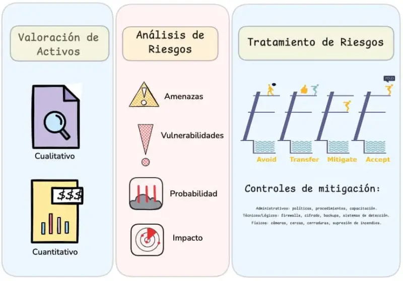

¿Sabías que el cibercrimen mueve casi el 0.8% del PIB Mundial?

Así es, a esta altura del partido el cibercrimen se ha vuelto un negocio muy lucrativo, más sofisticado y difícil de combatir.  

Con el avance de la tecnología la superficie de ataque se ha vuelto cada vez más amplia y si a eso le sumamos pocas medidas de protección, mayor dependencia de proveedores (terceros) y escasez de capital humano en ciberseguridad genera un ambiente perfecto para que el cibercrimen siga en crecimiento de manera exponencial.

Bueno y en esa línea ya identificado el problema que enfrentamos es que debemos salir de caja y dejar de pensar en seguridad como un tema exclusivamente técnico; La gestión de los riesgos en ciberseguridad como forma de resguardar la información, protegerla, mitigarla o evitarla…

“hey, vamos por partes Jack”...

### ¿Qué es la gestión de riesgos en ciberseguridad?
La gestión de riesgos en ciberseguridad es un tema súper importante en seguridad, y aún más con la violenta irrupción de las tecnologías cloud (nube). Como profesionales de la seguridad, enfrentamos un desafío colosal: ¿cómo protegemos de la mejor manera todos los activos de una organización, especialmente cuando muchos de esos activos están en la nube y son gestionados y asegurados por proveedores de servicios?

Nunca tenemos presupuestos ilimitados ni tiempo ilimitado para proteger todo como quisiéramos. Y cuando una organización externaliza sistemas, datos y sus operaciones, pierde en gran medida el control sobre la protección de esos activos, pero aún así sigue siendo responsable de protegerlos.

> **Entonces, ¿cómo protegemos de la mejor manera los activos internos y también los que han sido externalizados?**

Una herramienta súper útil para ayudarnos es, por supuesto, la Gestión de riesgos en ciberseguridad. La gestión de riesgos es un componente esencial de cualquier programa de seguridad, ya que permite a las organizaciones priorizar sus esfuerzos de seguridad y asignar recursos de forma eficaz.

Determinar qué controles deben implementarse para proteger los activos y asegurarse de que los proveedores de servicios los están aplicando es el objetivo prioritario de la gestión de riesgos.

Bien, veamos algunas definiciones que nos pueden ayudar:

- **Perfil de riesgo:** Es una evaluación completa de la tolerancia al riesgo, la capacidad y las preferencias de una organización. Sirve como guía para la toma de decisiones, ayudando a determinar qué tipos y niveles de riesgo son aceptables.
- **Disposición al riesgo:** Es la cantidad y tipo de riesgo que una organización está dispuesta a asumir para alcanzar sus objetivos estratégicos. Es un concepto amplio y estratégico.
- **Tolerancia al riesgo:** Es la cantidad y tipo de riesgo que una organización está dispuesta a aceptar para cumplir con objetivos operacionales específicos. Se enfoca en riesgos operacionales concretos.

**¿Cómo se aplican estos conceptos en una empresa real?** Para ilustrar cómo se materializa el perfil de riesgo, la disposición al riesgo y la tolerancia al riesgo en el ámbito organizacional, consideremos el ejemplo ficticio de **«ElectroSur»**, una empresa eléctrica responsable del suministro eléctrico en una región determinada:

> - **Perfil de riesgo**
Debido a la naturaleza crítica de sus servicios para el suministro eléctrico nacional, tiene una baja tolerancia a interrupciones operacionales y ciberataques. Establece explícitamente que los riesgos operativos, especialmente los relacionados con seguridad en sistemas de control industrial (OT), serán altamente prioritarios, lo cual guiará todas sus decisiones futuras en gestión de riesgos en ciberseguridad.
> - **Disposición al riesgo**
La Empresa declara que está dispuesta a asumir ciertos riesgos relacionados con la adopción de nuevas tecnologías (por ejemplo, migración parcial a servicios en la nube para sistemas administrativos) con el fin de optimizar costos operacionales y mejorar su competitividad estratégica. Sin embargo, especifica que esta disposición por el riesgo no incluye sistemas críticos (SCADA, control remoto de subestaciones), donde prefiere asumir el menor riesgo posible.
> - **Tolerancia al riesgo**
En relación con la operación diaria, «ElectroSur» acepta un nivel moderado de riesgo en algunos procesos como mantenimiento preventivo de líneas de distribución, donde entiende que pueden ocurrir interrupciones breves del servicio. Sin embargo, establece que la tolerancia frente a incidentes de ciberseguridad o fallos en subestaciones debe ser extremadamente baja.

Existen diversos marcos o frameworks que ayudan a implementar una Gestión de riesgos en ciberseguridad efectiva y adaptada a diferentes contextos industriales y regulatorios. Entre los más destacados se encuentran:

**Risk Management Framework (RMF)** del [NIST (National Institute of Standards and Technology)](https://csrc.nist.gov/projects/risk-management), que proporciona un proceso estructurado e integral para gestionar riesgos en sistemas de información, especialmente valioso en entornos regulados y gubernamentales.

Otro modelo ampliamente utilizado es **ISO 31000**, de la [Organización Internacional para la Estandarización](https://www.iso.org/obp/ui#iso:std:iso:31000:ed-2:v1:es), que ofrece lineamientos generales para la gestión integral del riesgo aplicables a cualquier sector industrial.

Asimismo, para sectores específicos como el eléctrico, cobra gran relevancia el marco de ciberseguridad [**NERC-CIP** (North American Electric Reliability Corporation Critical Infrastructure Protection)](https://www.nerc.com/pa/Stand/Pages/ReliabilityStandards.aspx), que establece controles claros y detallados para proteger la infraestructura crítica frente a amenazas cibernéticas.

Estos marcos, aunque diversos en sus enfoques específicos, comparten principios fundamentales: identificar con claridad los activos críticos, comprender y evaluar las amenazas y vulnerabilidades asociadas, y establecer acciones efectivas para gestionar estos riesgos. Desde esta base conceptual común, la gestión de riesgos se enfoca concretamente en tres grandes pasos:

1. Valoración de activos
2. Análisis de riesgos
3. Tratamiento de riesgos

#### 1. Valoración de activos digitales
Es conceptualmente muy simple: asignar un valor a cada activo. Es decir, identificar cuán valioso es cada activo para la organización para poder clasificarlos desde el más hasta el menos valioso.

Aunque la idea es simple, es difícil en la práctica. Hay dos formas principales de clasificar los activos:

- **Análisis cuantitativo:** Asignar valor monetarios a los activos. Ej: “este activo vale 1000 pesos” o “1.8 millones de dólares”. Es el método preferido, pero raramente posible con precisión.
- **Análisis cualitativo:** Es una clasificación relativa, se compara un activo con otro (“este es más valioso que este otro”) y se agrupan en categorías como alto, medio o bajo.

|Cuantitativo| Cualitativo |
|--|--|
| Asigna valores monetarios objetivos | No intenta asignar valores monetarios objetivos. |
|Proceso que considera lograr una visión matemática objetiva completamente cuantitativo cuando todos los elementos.| Sistema de clasificación relativa basada en juicios profesionales o comités de expertos. |
|Es difícil de lograr valores que dejen conformes a la mayoría y consume mucho tiempo.| Usa palabras como «Bajo,» «Medio,» «Alto,» «1–5,» «Probabilidad,» o «Posibilidad» para expresar valor. |
|El análisis cualitativo es relativamente simple y eficiente.|  |

#### 2. Análisis de riesgos cibernéticos
Aquí identificamos los riesgos asociados a cada activo, considerando cuatro factores: amenazas, vulnerabilidades, impacto y probabilidad.

- Amenazas: cualquier evento, situación o acción que pueda causar daño (desastres naturales, ciberataques, fraude, errores humanos).
- Vulnerabilidades: debilidades o brechas que pueden ser explotadas. Se identifican con evaluaciones de vulnerabilidades y pruebas de penetración.
- Probabilidad: la posibilidad de que ocurra un evento riesgoso.
- Impacto: el daño potencial (ej: interrupciones, daño reputacional, pérdida de datos, ransomware).

Una vez que tenemos la lista de riesgos, también debemos clasificarlos. Nuevamente, se puede hacer con análisis cuantitativo o cualitativo.

- Análisis cuantitativo de riesgos: estimar cuánto costará anualmente un riesgo.
  Usamos la fórmula: ALE = SLE × ARO
- SLE (Pérdida esperada única) = Valor del activo × Factor de exposición (porcentaje de pérdida esperada).
- ARO (Frecuencia anual esperada) = Número de veces al año que se espera que ocurra el riesgo.
- ALE (Pérdida esperada anualizada) = Costo total anual estimado del riesgo.

Pero muchas veces no es posible obtener datos precisos para aplicar esta fórmula, por eso generalmente se usa el análisis cualitativo, que aunque imperfecto, es mejor que nada.

### 3. Tratamiento y mitigación de riesgos
Aquí decidimos qué hacer con los riesgos identificados. Para la gestión de riesgos en ciberseguridad hay cuatro estrategias principales:

1. Evitar: eliminar la causa del riesgo. Ej: no subirse a un avión sin paracaídas.
2. Transferir: trasladar el impacto financiero a un tercero, como un seguro. Pero no se transfiere la responsabilidad.
3. Mitigar: aplicar controles para reducir el riesgo. Aquí es donde más trabajamos como profesionales de seguridad. *Siempre quedará algo de riesgo residual.*
4. Aceptar: decidir conscientemente asumir el riesgo. Esto lo debe hacer el dueño del activo.

#### Controles de mitigación
Hay tres tipos de controles principales según su naturaleza:

1. Administrativos: políticas, procedimientos, capacitación.
2. Técnicos/Lógicos: firewalls, cifrado, backups, sistemas de detección.
3. Físicos: cámaras, cercas, cerraduras, supresión de incendios.

Y según su función se dividen en:

- Salvaguardas:
  - Directivos: guían comportamientos (ej: políticas).
  - Disuasivos: desalientan acciones riesgosas (ej: señales de advertencia).
  - Preventivos: evitan que ocurra el riesgo (ej: cercas, firewalls).
- Contramedidas:
  - Detectivos: identifican riesgos en curso o ya ocurridos (ej: sistemas SIEM, IDS).
  - Correctivos: reducen el impacto después del riesgo (ej: sistemas contra incendios).
  - Recuperación: ayudan a volver a la normalidad (ej: planes de recuperación ante desastres).

#### Riesgo residual
Es el riesgo que queda después de aplicar todos los controles. Siempre hay riesgo residual, y debe ser aceptado formalmente por el dueño del activo.

### ¿Gasto o inversión estratégica?
Cuando proponemos implementar medidas de seguridad, con frecuencia recibimos miradas inquisidoras seguidas por la pregunta clásica del gerente de finanzas: «¿Realmente necesitamos gastar en esto?» Pero, ¿qué pasaría si dejamos de hablar de gastos y comenzamos a enfocarnos en inversiones estratégicas?

**La clave está en el contexto.** Pensemos de forma práctica: ¿Una puerta trasera (backdoor) en Windows implica el mismo nivel de amenaza para un banco que para el negocio de barrio «La Chepa»? Claramente no. Mientras para el banco esa vulnerabilidad podría significar pérdidas millonarias, para «La Chepa» posiblemente no sea más que una preocupación marginal.

Evaluar correctamente un riesgo en función del valor que aporta su mitigación significa justamente eso: entender con claridad cuánto beneficio real obtendremos al implementar una solución específica. A**sí podremos afirmar con confianza: «Invertir $10.000 dólares en este sistema de monitoreo reducirá en un 80% la probabilidad de sufrir un ataque de ransomware, protegiendo activos valuados en $2 millones.»**

Este enfoque práctico y orientado al negocio permite que las decisiones sobre gestión de riesgos en ciberseguridad dejen de ser vistas como simples costos y se conviertan en verdaderas oportunidades de ahorro, protección y crecimiento estratégico.

### Mejora Continua en la Gestión de Riesgos: No es una meta, es un camino constante
La gestión de riesgos no termina en el momento que aplicamos un control de seguridad. Por el contrario, apenas comienza. Es como cuando vas al gimnasio y logras bajar esos kilos extra; una vez que alcanzas tu meta, ¿dejas de entrenar? No, porque sabes que el éxito sostenido requiere un esfuerzo constante. De igual forma, gestionar los riesgos implica mantener una rutina permanente de evaluación, ajuste y mejora.

Aquí es donde entra en juego el ciclo de mejora continua (Planificar, Hacer, Verificar, Actuar – PDCA), que permite mantener a la organización siempre alerta y preparada.

Este ciclo es simple y efectivo:

- Planificar: identificamos riesgos y definimos controles adecuados.
- Hacer: implementamos esos controles.
- Verificar: evaluamos constantemente su efectividad frente a nuevas amenazas.
- Actuar: ajustamos o mejoramos continuamente las medidas adoptadas.

La gestión efectiva del riesgo requiere una mentalidad dinámica. En otras palabras, la mejora continua no es solo una buena práctica, sino una necesidad estratégica vital para que tu organización permanezca segura, resiliente y competitiva frente a un entorno siempre cambiante.

> Implementar un sistema robusto de gestión de riesgos es el primer paso hacia un modelo de seguridad maduro y resiliente.

## ¿Tu organización tiene una estrategia clara para gestionar los riesgos cibernéticos?
Desde Codevsys, ayudamos a empresas de sectores críticos a construir un enfoque integral de gestión de riesgos en ciberseguridad basado en normas internacionales como NERC-CIP, ISO 27001 y los mejores marcos de ciberseguridad industrial.

🔐 Te acompañamos en cada etapa:

Análisis de riesgos tecnológicos y operacionales.
Implementación de controles de mitigación y respuesta a incidentes.
Evaluaciones de madurez y cumplimiento normativo.

