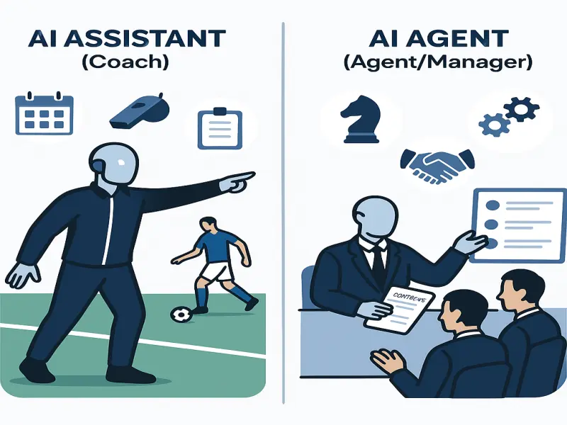

*"Imagina que eres un jugador de fútbol profesional. Tienes un entrenador y un agente. El entrenador te da instrucciones específicas en cada entrenamiento: 'Llega a la marca', 'Cierra la pinza', 'Mejora tu definición'. Pero el agente busca oportunidades para ti: negocia contratos, consigue patrocinios, te posiciona en el mercado, incluso sin que se lo pidas. Así funciona la inteligencia artificial hoy: hay 'entrenadores' (AI assistants) y 'agentes' (AI agents)."*

A diario vemos cómo las empresas dan sus primeros pasos en IA con asistentes virtuales, pero pronto descubren que la verdadera transformación ocurre cuando incorporan agentes de IA. ¿Por qué? Porque la diferencia entre ambos no es solo técnica, sino estratégica.

## Asistentes de IA: reactivos y eficientes

Los **AI assistants** son como ese colaborador que siempre espera tus instrucciones. Son reactivos: necesitan un prompt o comando para actuar. Ejemplos conocidos son Siri, Alexa o ChatGPT. Estos asistentes, basados en modelos de lenguaje (LLMs), destacan en tareas como:

- Organizar información
- Responder consultas de clientes
- Generar contenido bajo demanda
- Automatizar tareas repetitivas (como redactar documentos o programar reuniones)

Pero siempre requieren que el usuario los dirija, como un partido de tenis: prompt, respuesta, prompt, respuesta. Incluso cuando mejoran gracias al *prompt tuning* o *fine tuning*, siguen dependiendo de instrucciones claras y bien definidas.

## Agentes de IA: proactivos y autónomos

Los **AI agents**, en cambio, son los estrategas del equipo. Tras recibir un objetivo inicial, actúan de forma autónoma para alcanzarlo, descomponiendo tareas, diseñando flujos de trabajo y tomando decisiones sin necesidad de supervisión constante. Un solo prompt basta para que un agente:

- Analice datos internos y externos
- Use herramientas y APIs para ejecutar acciones
- Coordine múltiples procesos simultáneamente
- Aprenda de la experiencia y mejore sus decisiones futuras

Por ejemplo, si el objetivo es “optimizar la estrategia de ventas”, el agente puede analizar tendencias, consultar bases de datos, proponer cambios y ejecutar acciones, todo sin intervención humana directa.

> El AI Assistant es como el entrenador que te ayuda a mejorar día a día, mientras que el AI Agent es el representante que impulsa tu carrera, anticipa oportunidades y resuelve desafíos complejos.

## Ejemplo real: de la reacción a la anticipación

Supongamos que tu empresa de e-commerce enfrenta un aumento de reclamos por entregas tardías. Un AI assistant puede ayudarte a responder rápidamente a cada cliente, pero solo si le das la instrucción para cada caso. Un AI agent, en cambio, detecta el patrón, investiga causas en logística, coordina con proveedores, ajusta rutas y comunica proactivamente a los clientes afectados, todo de manera autónoma.

## Casos de uso y diferencias clave

- **Asistentes**: brillan en atención al cliente, chatbots, generación de código, análisis de datos simples. Reducen el tiempo en tareas repetitivas, pero requieren supervisión.
- **Agentes**: ideales para trading automatizado, monitoreo de redes, optimización de procesos complejos y resolución de problemas ambiguos. Pueden escalar y operar sin intervención humana, resolviendo desafíos de alto nivel.

## Limitaciones y desafíos

Ninguna tecnología es perfecta. Tanto asistentes como agentes pueden ser frágiles ante cambios inesperados en los prompts o requerir muchos recursos computacionales. Los agentes, en particular, pueden atascarse en bucles de retroalimentación o tomar caminos inesperados si no se supervisan adecuadamente. Por eso, siempre es clave validar sus resultados y ajustar sus parámetros.

## El futuro: sinergia entre asistentes y agentes

No se trata de elegir uno u otro. El futuro de la IA en la empresa será la colaboración entre asistentes y agentes, combinando la eficiencia reactiva de los primeros con la autonomía estratégica de los segundos. Así, tu organización podrá abordar tanto tareas simples como desafíos complejos, anticipándose a los cambios del mercado.

## Tu momento de definición

La pregunta ya no es si necesitas IA, sino qué tipo de IA quieres como socio estratégico. ¿Un asistente que espera tus órdenes, o un agente que toma la iniciativa y te ayuda a anticiparte a los desafíos?

En palabras de Oscar Wilde, 'El progreso es la realización de las utopías'. En Codevsys, creemos que la verdadera innovación ocurre cuando pasamos de la conversación a la acción inteligente. Por eso, te ayudamos a dar el salto hacia la autonomía con AI agents que convierten la visión en resultados concretos.

---

¿Listo para transformar tu operación?
**Contáctanos** y descubre cómo los AI agents pueden llevar tu empresa al siguiente nivel.