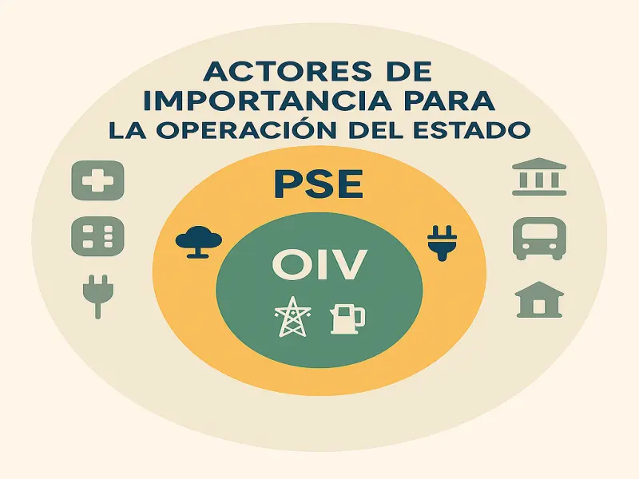

# Ley de Ciberseguridad Chilena: No hay transformación digital sin seguridad de la información

La transformación digital es imparable. Servicios públicos, empresas, ¡todo está en línea! Pero, ¿estamos protegiendo lo que realmente importa? La [Ley Marco de Ciberseguridad](https://www.leychile.cl/leychile/Navegar?idNorma=1202434) llega para poner orden y protegernos de las crecientes amenazas. ¿Sabes de qué se trata y cómo te afecta?

## ¿Por qué una Nueva Ley de Ciberseguridad?

En los últimos años, los ciberataques no han parado de crecer. Dependemos cada vez más de sistemas digitales, y eso nos hace vulnerables. Por eso, el Gobierno de Chile aprobó esta ley, que entró en vigencia el 1 de enero de 2025. ¿El objetivo? Fortalecer nuestra defensa y crear una cultura de prevención.

## ¿Qué Busca la Ley?

La Ley de Ciberseguridad busca que estemos protegidos al usar sistemas digitales. ¿Cómo? Previniendo incidentes, detectando amenazas y respondiendo rápido si algo sale mal. Aquí te contamos los puntos clave:

- **Infraestructuras Críticas a Salvo:** Si tu empresa es vital para el país, ¡ojo! La ley te exige tener sistemas de seguridad robustos, planes de emergencia y auditorías constantes. ¿Estás preparado para identificar y solucionar vulnerabilidades?
- **Reporte de Incidentes: ¡No te Quedes Callado!:** ¿Sufriste un ataque? Debes reportarlo al [CSIRT Nacional](https://www.csirt.gob.cl/). Así, todos estaremos alertas y podremos actuar rápido. ¿Sabes cómo y cuándo reportar un incidente?
- **Datos Protegidos: Tu Información es Valiosa:** La ley obliga a empresas y entidades públicas a proteger tus datos. ¿Cómo? Con protocolos y estándares de seguridad, registro de eventos y capacitación constante. ¿Estás seguro de que tus datos están a salvo?

## ¿Quiénes son los Prestadores de servicios esenciales (PSE) y los Operadores de Importancia Vital (OIV)? ¿Por qué es importante saberlo?

La Ley de Ciberseguridad distingue dos grandes tipos de actores obligados: los **Prestadores de Servicios Esenciales (PSE)** y los **Operadores de Importancia Vital (OIV)**. Los PSE son aquellas instituciones —públicas o privadas— que entregan servicios fundamentales para la vida diaria, como energía, agua, telecomunicaciones, salud, banca, transporte, servicios digitales y otros que la misma ANCI puede catalogar. Si tu empresa está en alguno de estos rubros, ¡atención! La ley te considera un actor clave para la seguridad del país.

A la fecha de este post (junio de 2025), los PSE tienen la obligación de inscribirse en la [ANCI](https://anci.gob.cl) junto a sus responsables de ciberseguridad. Este registro permite a la Agencia tener un control actualizado y facilita que los reportes de incidentes sean más rápidos y eficientes, ganando tiempo valioso ante cualquier amenaza.

Por otro lado, la figura de los OIV está en pleno proceso de definición. Desde el 30 de mayo de 2025, la ANCI inició la calificación de los Operadores de Importancia Vital, comenzando con sectores como energía, telecomunicaciones, infraestructura digital, banca, salud y organismos públicos. Este proceso incluye informes técnicos, una nómina preliminar y una consulta pública antes de publicar la lista final. Otros sectores, como transporte, agua y servicios sociales, comenzarán su calificación el 30 de noviembre de 2025.

¿Tu organización podría ser considerada PSE u OIV? Es fundamental identificarlo, porque de eso depende el nivel de obligaciones y controles que deberás implementar para cumplir con la ley y proteger tu operación.

## ¿Qué exige la Ley? Requisitos mínimos para cumplir

Para estar alineado con la Ley de Ciberseguridad, tanto los Prestadores de Servicios Esenciales (PSE) como los Operadores de Importancia Vital (OIV) deben implementar una serie de medidas mínimas. Entre ellas destacan:

- **Capacitación continua:** Todo el personal debe recibir formación periódica en ciberseguridad, adaptada a su rol y nivel de acceso.
- **Políticas y procedimientos de ciberseguridad:** Es obligatorio contar con políticas claras y actualizadas, alineadas a estándares internacionales como [ISO/IEC 27001](https://www.iso.org/isoiec-27001-information-security.html), [NIST Cybersecurity Framework](https://www.nist.gov/cyberframework), y frameworks sectoriales específicos como [NERC-CIP](https://www.codevsys.cl/servicios/consultoria-nerc-cip) para la industria eléctrica. Es crucial demostrar que se aplican en la práctica.
- **Planes de continuidad y recuperación:** Debes tener planes de continuidad operativa y recuperación ante desastres, probados y revisados al menos una vez al año, para asegurar la operación frente a incidentes.
- **Gestión y reporte de incidentes:** Es fundamental contar con un plan de respuesta a incidentes, con procedimientos claros para detectar, contener, mitigar y reportar ciberataques al CSIRT Nacional en los plazos exigidos por la ANCI.
- **Monitoreo y auditoría:** Implementa monitoreo continuo de tus sistemas, realiza auditorías periódicas y mantén registros de actividades informáticas.
- **Designación de responsables:** Debes nombrar un encargado de ciberseguridad (CSO o CISO) que reporte a la alta dirección y tenga autonomía para tomar decisiones clave.
- **Adopción de protocolos y estándares de la ANCI:** Cumple con las directrices y taxonomías oficiales publicadas por la [Agencia Nacional de Ciberseguridad](https://anci.gob.cl).
- **Registro e inscripción:** Los PSE deben inscribirse en la [plataforma de la ANCI](https://portal.anci.gob.cl/) y registrar a sus responsables, para facilitar la gestión y el reporte de incidentes.

Cumplir con estos requisitos no solo evita sanciones, sino que fortalece la resiliencia de tu organización y la confianza de tus clientes.

## ¿Qué Pasa si No Cumples la Ley?

Las sanciones van desde multas leves hasta gravísimas, ¡de hasta 40.000 UTM para OIV! No te arriesgues.

- **Leves:** Si te equivocas en algo pequeño, como entregar información tarde, te multarán hasta 5.000 UTM (PSE) o 10.000 UTM (OIV).
- **Graves:** Si no reportas incidentes o no tienes medidas preventivas, la multa será hasta 10.000 UTM (PSE) o 20.000 UTM (OIV).
- **Gravísimas:** Si das información falsa o evades la seguridad, ¡la sanción será hasta 20.000 UTM (PSE) o 40.000 UTM (OIV)!

## ¿Dónde Encontrar Ayuda?

La ANCI te ofrece:

- **[Ciberconsejos](https://anci.gob.cl/ciberconsejos/):** Información clara y práctica en su página web.
- **Infografías y Guías:** Materiales visuales para entender la ley fácilmente.
- **Capacitación:** Programas para que te conviertas en un experto en ciberseguridad.

## ¿Cómo puede ayudar Codevsys?

En [Codevsys](https://www.codevsys.cl) entendemos que cumplir con la Ley de Ciberseguridad puede ser complejo. Por eso, ofrecemos servicios especializados para ayudarte a:

- **Evaluación de cumplimiento:** Diagnóstico completo de tu estado actual frente a los requisitos de la ley.
- **Implementación de controles:** Desarrollo e implementación de políticas, procedimientos y controles técnicos.
- **Capacitación especializada:** Programas de formación adaptados a tu sector y nivel de riesgo.
- **Gestión de incidentes:** Soporte para establecer y operar tu plan de respuesta a incidentes.

## ¿Qué Esperamos para el Futuro?

Chile está cambiando su forma de ver la ciberseguridad. Se vienen más protocolos, normas y colaboración. ¡Prepárate para un futuro digital más seguro!

---

**¿Tu organización está preparada?** En [Codevsys](https://www.codevsys.cl) ayudamos a empresas de todos los tamaños a entender y aplicar estas leyes, diseñar sus políticas, entrenar a sus equipos y fortalecer su seguridad digital. [Contáctanos](https://www.codevsys.cl/contact) para una evaluación inicial sin costo.

